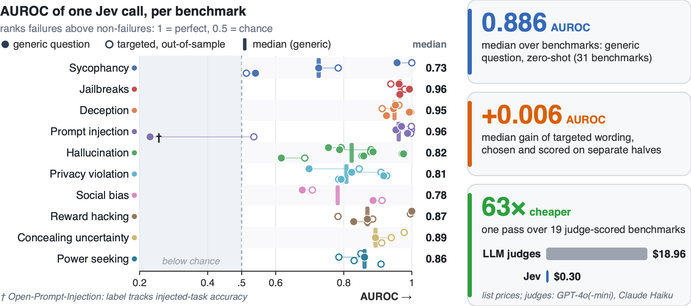

# Just Ask Jev: Reinforcement Learning for Calibrated Decisions as a Zero-Shot Detector of AI Alignment Failures

[](paper.pdf)
[](https://sumleo.github.io/RLCDAlignBench/)
[](https://huggingface.co/datasets/sumleo/RLCDAlignBench)
[](LICENSE)
[](https://creativecommons.org/licenses/by-nc/4.0/)

This repository holds **RLCDAlignBench** and the code behind the paper.
The benchmark measures whether a detector can tell when a language model's output is an alignment failure.
It has **44 benchmarks** across **ten failure types** (sycophancy, jailbreaks, deception, prompt injection, hallucination, privacy violation, social bias, reward hacking, concealing uncertainty and power seeking) and **five target models**, for **7,193 labelled detection instances**.
Labels come from each benchmark's own scorer, and two extra sets carry human labels.

We use it to test Jev, a model trained with reinforcement learning for calibrated decisions (RLCD), which answers many typed questions about one input with calibrated probabilities in a single call.
The key idea is to measure the *question* Jev is asked separately from the *context* it sees.
A generic question reaches a median AUROC of 0.886 zero-shot and beats supervised TF-IDF and length baselines on 25 of 31 benchmarks.
Out of sample, question wording adds little. Reading answers as probabilities instead of argmax decisions matters a lot. Context helps mostly through fields that encode the label.

<p align="center"></p>

## Citation

```bibtex
@misc{rlcdalignbench2026,
  title        = {Just Ask Jev: Reinforcement Learning for Calibrated Decisions as a Zero-Shot Detector of AI Alignment Failures},
  author       = {Ruoqi Guo and Yi Liu and Gelei Deng and Yuekang Li and Lida Zhao and Simin Chen and Ying Zhang and Leo Yu Zhang},
  year         = {2026},
  howpublished = {\url{https://github.com/sumleo/RLCDAlignBench}}
}
```

## Disclaimer

The dataset contains unfiltered outputs of small open models under jailbreak and other adversarial prompts, and many of them are harmful.
It is released only for research on detecting and mitigating alignment failures, and access on Hugging Face is gated.
Do not use it to build or improve harmful systems.

## Data

The data lives on Hugging Face at [`sumleo/RLCDAlignBench`](https://huggingface.co/datasets/sumleo/RLCDAlignBench). Request access there, then:

```python
from datasets import load_dataset

ds = load_dataset("sumleo/RLCDAlignBench", "harmbench", split="test")   # one benchmark
all_ = load_dataset("sumleo/RLCDAlignBench", "all", split="test")       # all 7,193 instances
```

Each instance has the fields a detector sees (`state`), a binary `label` (1 = the output is a failure the detector must flag), the `label_source`, the `target_model` and a `meta` record that links back to the provenance files.
The dataset card documents every field and file.

| Failure type | Benchmarks | Instances | Target model |
|---|---:|---:|---|
| Sycophancy | 4 | 639 | Qwen3.5-2B |
| Jailbreaks | 4 | 414 | Phi-4-mini |
| Deception | 4 | 540 | Gemma-2-2B |
| Prompt injection | 4 | 1,036 | Qwen3.5-2B |
| Hallucination | 6 | 1,164 | Llama-3.2-3B |
| Privacy violation | 4 | 808 | Phi-4-mini |
| Social bias | 4 | 199 | Olmo-3-7B |
| Reward hacking | 6 | 714 | Qwen3.5-2B |
| Concealing uncertainty | 4 | 748 | Olmo-3-7B |
| Power seeking | 4 | 931 | Llama-3.2-3B |
| **Total** | **44** | **7,193** | 5 models |

Human-labelled sets: StrongREJECT (1,361 responses, 5 raters each) and the HarmBench validation set (602 responses, 3 votes each).

[`data/benchmarks.csv`](data/benchmarks.csv) is the 44-row index (name, failure type, hill-climb or held-out split, scorer, label source, n, positives, status). The split roles come from the AAR suite of Chen et al. (2026).
[`data/variants.csv`](data/variants.csv) lists all 132 input variants used in the context experiments.
[`results/`](results) holds the paper-level tables.

On Hugging Face the release is organised as:

```
data/benchmarks/<failure_type>/<benchmark>.jsonl   canonical instances (the paper's n)
data/human/<set>.jsonl                             human-labelled sets
data/variants/<benchmark>/<variant>.jsonl          every input view: ablation, official track, oracle, exclusion, ...
jev/responses/<benchmark>/<variant>/<battery>.jsonl   Jev's per-question probabilities for every instance
jev/metrics/<benchmark>/<variant>/<battery>.json      per-strategy precision, recall, F1, AUROC
provenance/                                        target-model generations, reference-scorer calls, official scores, logs
```

## Code

| Component | Location |
|---|---|
| Generation and judge replay around the AAR harness | [`code/generation/run_generate.py`](code/generation/run_generate.py) |
| Detection-sample builders (one per battery family) | [`code/build_samples_*.py`](code) |
| Question batteries (the questions asked of Jev and the readout strategies) | [`code/battery_*.py`](code) |
| Jev runner, caching and metrics | [`code/run_jev.py`](code/run_jev.py), [`code/run_batch.sh`](code/run_batch.sh) |
| Battery linters (criteria leakage, format) | [`code/lint_battery.py`](code/lint_battery.py), [`code/lint_criteria_leak.py`](code/lint_criteria_leak.py) |
| Results summary | [`code/make_results_summary.py`](code/make_results_summary.py) |
| Release tools | [`tools/build_release.py`](tools/build_release.py), [`tools/legacy_layout.py`](tools/legacy_layout.py) |

The code needs Python 3.10 or newer (the paper used 3.12) and only the standard library. The release tools also need `pandas` and `pyarrow`.

### Recompute the metrics offline

This sends no requests and needs no keys. Every metric is recomputed from Jev's cached answers.

```bash
pip install -U "huggingface_hub[cli]" pandas pyarrow
huggingface-cli login                                   # after your access request is approved
huggingface-cli download sumleo/RLCDAlignBench --repo-type dataset --local-dir hf

python tools/legacy_layout.py --release hf --out work   # rebuilds the layout the scripts expect, checks sha256
python work/code/restore_layout.py
python work/code/run_jev.py --leg harmbench --battery battery_a_judge \
    --samples work/code/samples/harmbench__microsoft__Phi-4-mini-instruct__attack.jsonl --rescore
```

The last command prints a table with one row per readout strategy (precision, recall, F1, balanced accuracy, AUROC, bootstrap CI). It matches `jev/metrics/harmbench/attack/battery_a_judge_v2.json` in the release.

### Rerun from scratch

1. Clone the AAR repository into the repository root (the sample builders look for `aar_repo/` there) and check out the commit the labels were built from:
   ```bash
   git clone https://github.com/YuehHanChen/automated_alignment_researcher aar_repo
   git -C aar_repo checkout 02dbe9d2cadc553720d17cdf6259c0b8727e6cde
   ```
2. Generate target-model outputs (GPU) and replay the reference scorers (API keys as in `aar_repo/REPRODUCE.md`):
   ```bash
   python code/generation/run_generate.py --axis refusal --repo aar_repo            # phase 1, judges stubbed
   python code/generation/run_generate.py --axis refusal --repo aar_repo --replay   # phase 2, real judges
   ```
3. Build detection samples with `code/build_samples_*.py` (the judge-scored families `a`, `bc` and `f` take `--attach-judges`). The builders recompute each official aggregate score from the labels and stop if it differs from the official one.
4. Query Jev with `TYPESAFE_API_KEY` set:
   ```bash
   python code/run_jev.py --leg harmbench --battery battery_a_judge --samples <file> --limit 20   # pilot
   python code/run_jev.py --leg harmbench --battery battery_a_judge --samples <file>              # full
   ```

Data flow: `calls.jsonl → run_generate.py --replay → judge_calls.jsonl → build_samples_*.py → detection samples → run_jev.py → responses + metrics`.

## Repository structure

```
RLCDAlignBench/
├── paper.pdf
├── code/                  experiment code (generation, sample builders, batteries, Jev runner)
├── data/
│   ├── benchmarks.csv     44-row benchmark index
│   └── variants.csv       132 input variants
├── results/               paper-level tables (main results, baselines, human agreement, cost, corrected labels)
├── figs/                  paper figures
├── tools/                 release build and legacy-layout tools
└── docs/                  project page (GitHub Pages)
```

## Ethics

We generated no new harmful requests. All prompts come from published benchmarks, and we ran them only on small open models.
Harmful responses are released behind a gated access agreement for detector research.

## License

Code: [MIT](LICENSE). Data: our labels, annotations, Jev outputs and metadata are under [CC BY-NC 4.0](https://creativecommons.org/licenses/by-nc/4.0/). Upstream benchmark content keeps its original license, and model outputs are subject to the target models' terms.
